# Grout User Guide

This guide walks you through using Grout's interface to download games from your RomM instance.

## Table of Contents

- [First Launch and Login](#first-launch-and-login)
- [Platform Directory Mapping](#platform-directory-mapping)
- [Main Menu - Platform Selection](#main-menu--platform-selection)
- [Collections](#collections)
- [Game List](#game-list)
- [Search](#search)
- [Game Details](#game-details)
- [Downloading Games](#downloading-games)
- [Settings](#settings)
- [Save Sync](#save-sync)

---

## First Launch and Login

When you first launch Grout, you'll be greeted with this login screen.

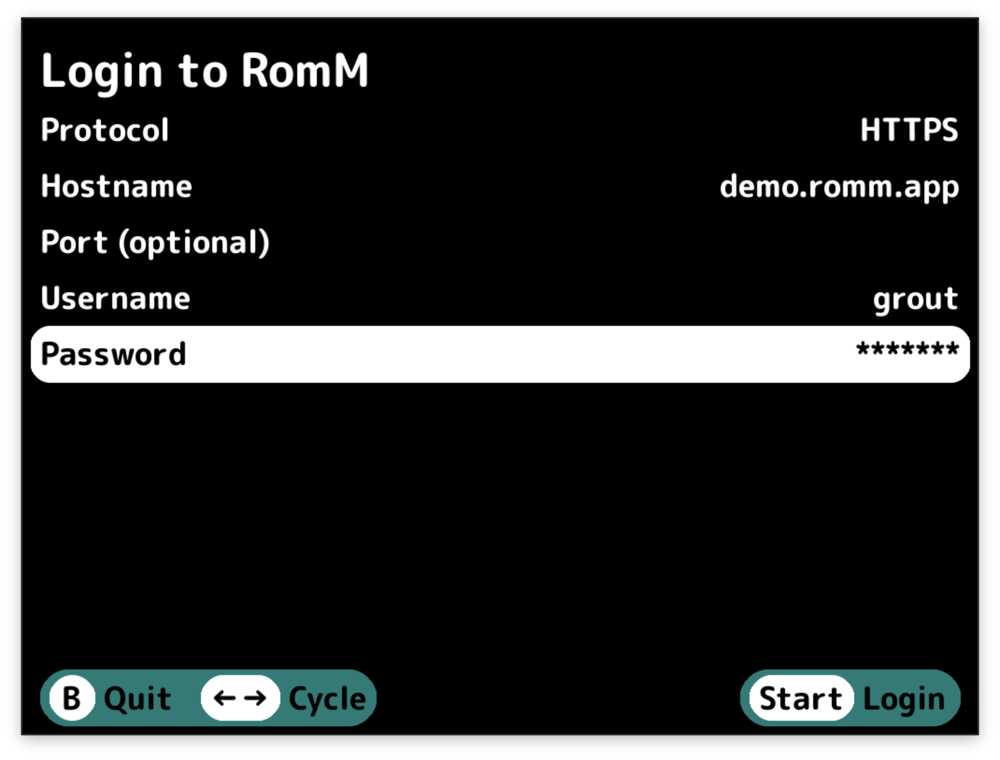

1. **Protocol** – Choose between HTTP and HTTPS.
2. **Hostname** – Enter your RomM server address without the protocol.
3. **Port (optional)** – If your RomM instance runs on a non-standard port, enter it here.
4. **Username** - Your RomM username.
5. **Password** - Your RomM password.

Use the left and right buttons to cycle through options for Protocol. For the text fields (Hostname, Username,
Password), pressing `A` will open an on-screen keyboard.

Press `Start` to login. If your credentials are correct and Grout can reach your server, you'll move
to the next step. If something goes wrong, you'll get a message telling you what happened, and you can try again.

> [!NOTE]
> **OIDC Users:** If your RomM instance uses OIDC authentication, you can still use Grout by setting a password for your user account. Grout will support API Keys once they are available in RomM. For more details, see [this GitHub issue](https://github.com/rommapp/romm/issues/1767#issuecomment-2744215262).

---

## Platform Directory Mapping

After logging in successfully for the first time, you'll need to map your RomM platforms to directories on your device.
This tells Grout where to put the games that you download.

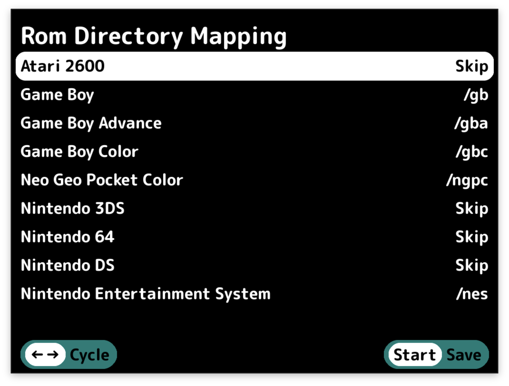

You'll see a list of all platforms from your RomM instance. For each one, you can select:

- **Skip** – Don't map this platform. Games from this platform won't be available to download.
- **Create {Directory Name}** – Create a new directory for this platform. Grout will automatically suggest directory
  names that match your custom firmware's expected structure.
- **/{Existing Directory}** – Map to an existing directory on your device.

Grout tries to be smart about this. If you already have a directory that matches the platform name, it'll be
pre-selected. If not, it'll suggest creating one with the correct name for your firmware.

Use left/right to cycle through the options for each platform. When you're happy with your mappings, press `Start` to
save. Grout will create any new directories you selected.

You can change these mappings later from the Settings menu.

---

## Main Menu – Platform Selection

Once you've logged in and set up your mappings, you'll land on the main menu. This is your home base for browsing your
RomM collection.

")

At the top, you'll see "Collections" (if you have any collections set up in RomM). Below that, you'll see all your RomM
platforms – NES, SNES, PlayStation, whatever you've got.

**Navigation:**

- `Up/Down` to scroll through platforms
- `A` to select a platform or collection
- `X` to open Settings
- `Y` to open the Save Sync menu
- `Select` to enter reordering mode
- `B` to quit Grout

**Reordering Platforms:**

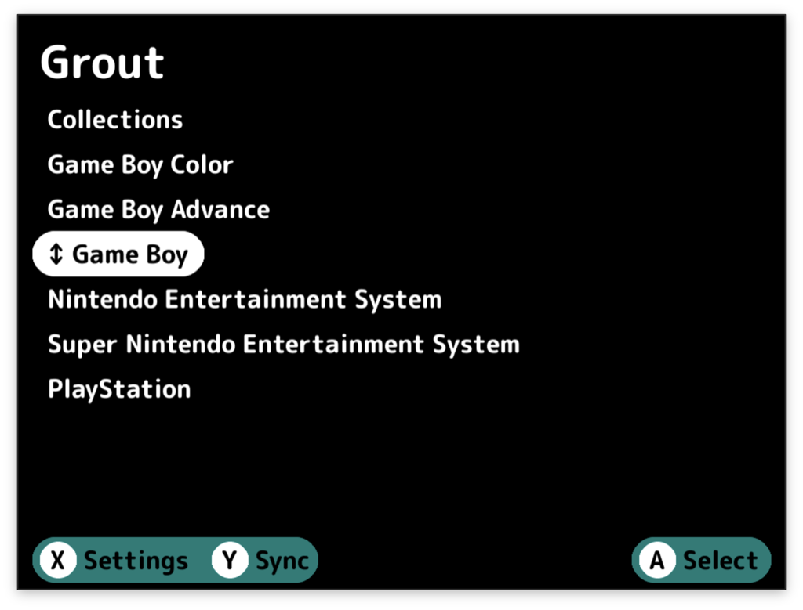

Press `Select` to enter reordering mode. You'll see a ↕ indicator next to the currently selected platform. Use the D-pad to this platform up and down:

- `Up/Down` to move the platform one position
- `Left/Right` to move the platform one page at a time

Press `A` to place the selected platform into its new position. Your custom platform order is automatically saved to the config and will persist across sessions. New platforms you add to RomM later will appear alphabetically at the end of your custom order.

---

## Collections

Collections are custom groupings you can create in RomM - like "My Favorites," "Beat 'em Ups," or "Franchises."
They're a great way to organize games across multiple platforms.

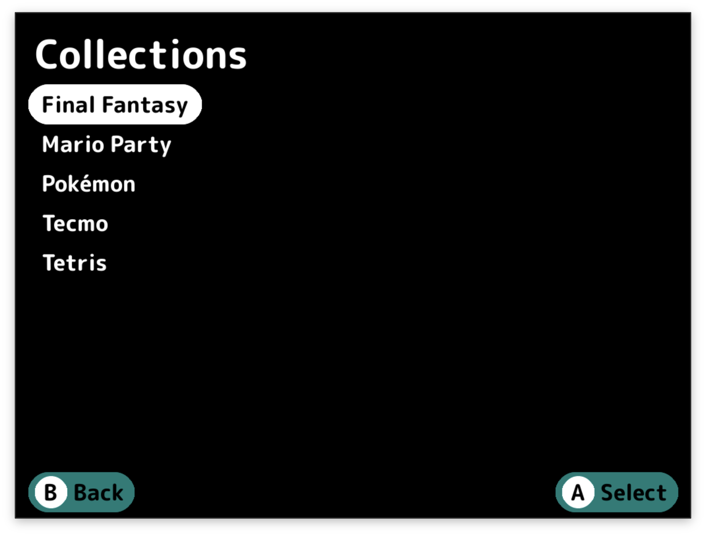

After selecting Collections from the main menu, you'll see all your collections. Pick one and press `A`.

If your collection has games from multiple platforms, you'll see a platform selection screen next. This lets you filter
the collection to just one platform at a time. If the collection is platform-specific, you'll go straight to the game
list.

> [!IMPORTANT]
> If you skipped a platform in the mapping screen, you won't see games for that platform in your collections.

---

## Game List

The game list is where you browse and select games to download.

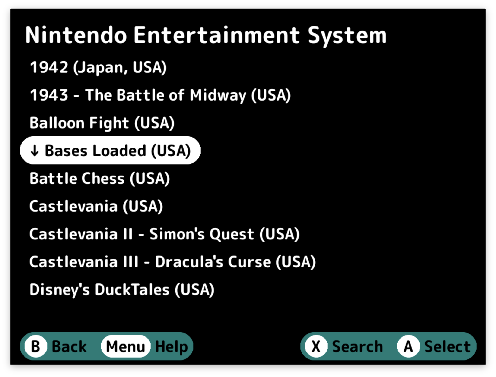

The title bar shows you where you are – either a platform name or a collection name.

If you entered a search query, you'll see `[Search: "your search term"] | Platform / Collection Name`.

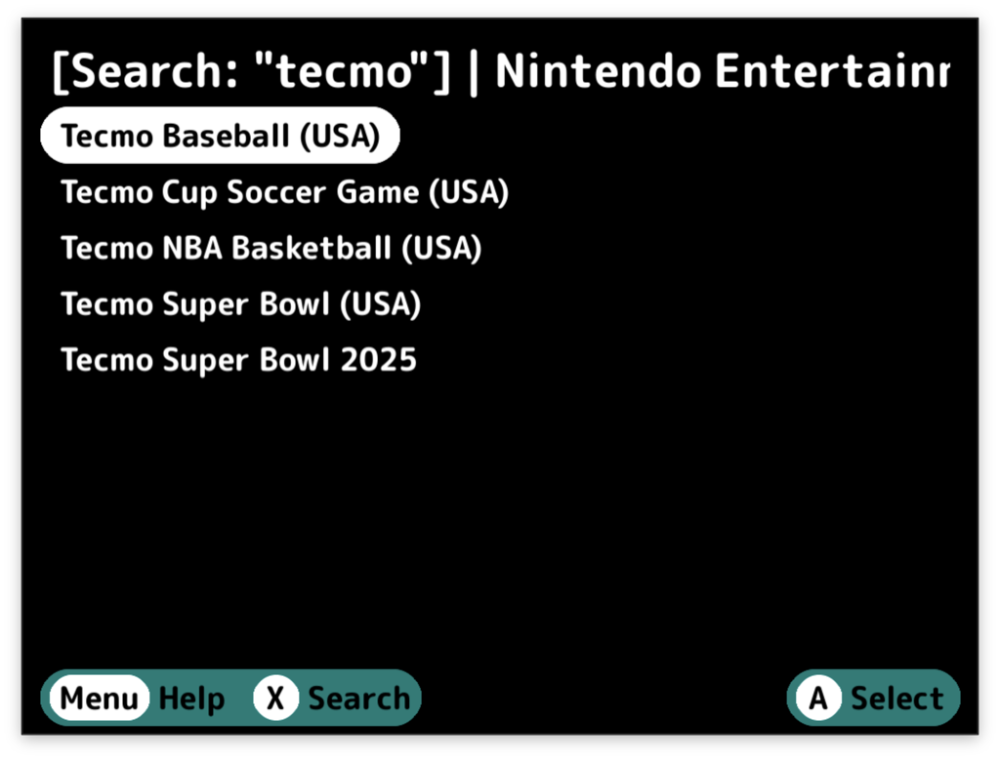

**Navigation and Selection:**

- `Up/Down` to scroll through games
- `Left/Right` to skip entire pages
- `A` to select a single game
- `Select` to enter multi-select mode, then use `A` to select/deselect games
- `X` to open the search keyboard
- `B` to go back

**Multi-Select Mode:**
Press `Select` once to enable multi-select. You'll see checkboxes appear next to each game. Now when you press `A` on a
game, it toggles selection instead of immediately downloading. This is perfect when you want to grab a bunch of games at
once.

Check all the ones you want, then press `Start` to confirm your selections.

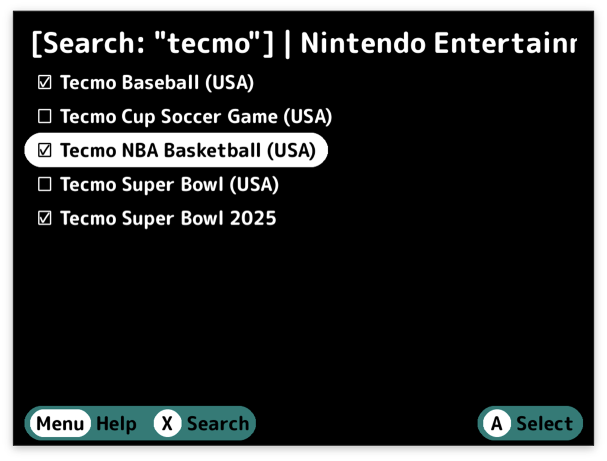

---

## Search

Press `X` from any game list to search.

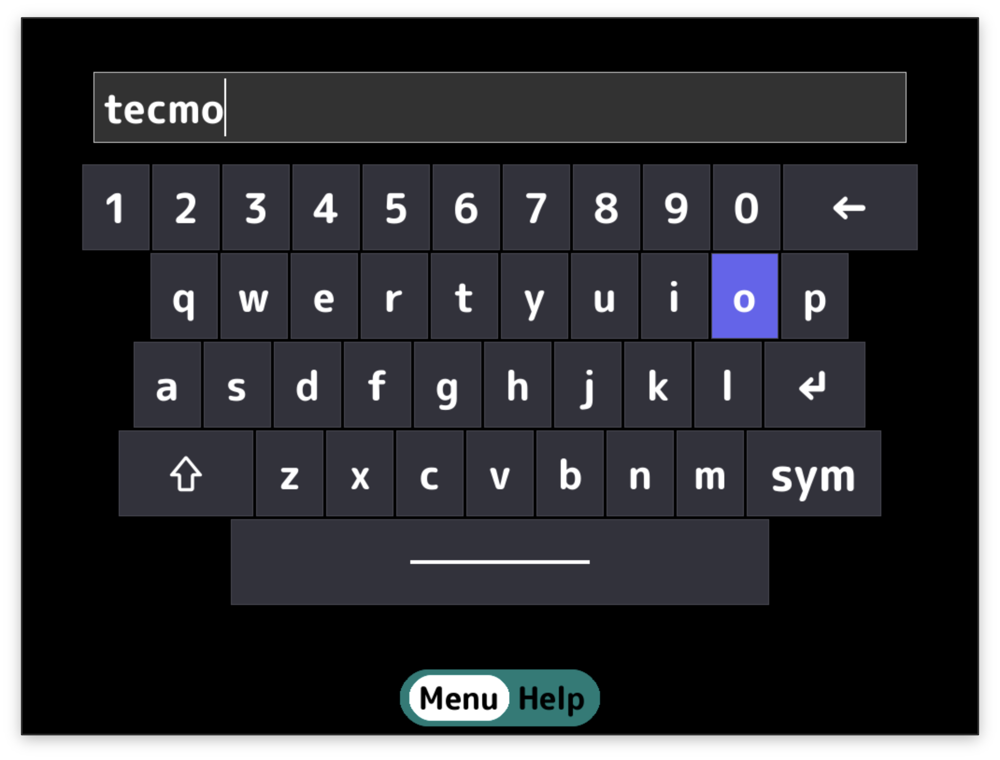

Type your search term using the on-screen keyboard and confirm. The game list will filter to show only matching titles.
The search is case-insensitive and matches anywhere in the game name.

To clear a search, press `B` to go back to the full results.

---

## Game Details

> [!IMPORTANT]
> This screen will only show if you've enabled "Show Game Details" in Settings.

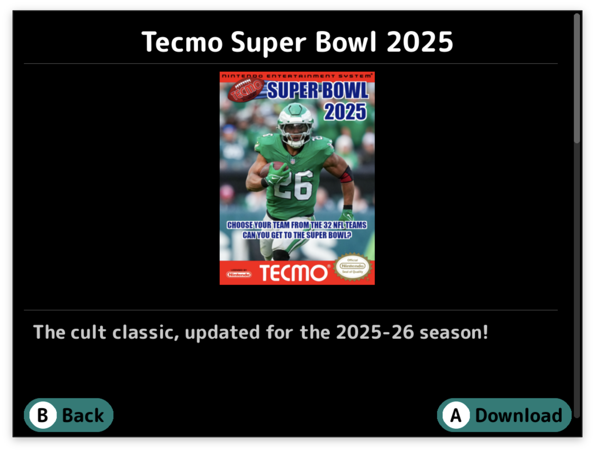

You'll see:

- **Cover art** – The game's box art (if available)
- **Summary** – A description of the game
- **Metadata** – Release date, genres, developers/publishers, game modes, regions, languages, and file size
- **Multi-file indicator** – If the game has multiple files (like multi-disc PlayStation games)
- **QR code** – Scan this to view the game's page on your RomM web interface

From here:

- `A` to download the game
- `B` to go back without downloading

---

## Downloading Games

After you've selected games (either from the game list or game details screen), the download manager kicks in.

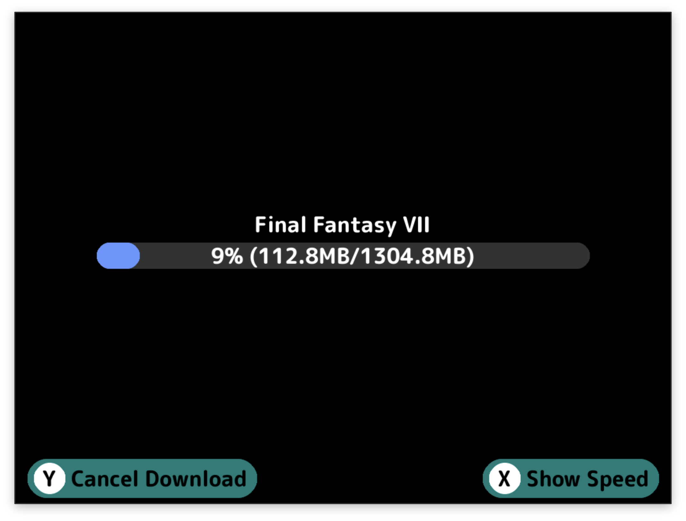

You'll see a progress bar and a list of games being downloaded. Grout downloads your ROMs directly from RomM to the
appropriate directory on your device. Press `Y` to cancel the download.

**What Happens During Download:**

1. **ROM files download** – The game files download to the correct platform directory you mapped earlier.

2. **Multi-file games get special treatment** – If you're downloading a multi-disc game, Grout downloads a zip file,
   extracts it, and creates an M3U playlist file so your emulator can handle disc switching.

3. **Artwork downloads** – If "Download Art" is enabled in Settings, Grout downloads box art for each game to your
   artwork directory after the ROMs finish.

4. **Automatic unzipping** – If "Unzip Downloads" is enabled in Settings, Grout automatically extracts any zipped ROMs
   and deletes the zip file.

If a download fails, Grout will show you which games had problems. Successfully downloaded games stay on your device,
failed downloads get cleaned up.

When everything's done, you're dropped back to the game list. The games you just downloaded are now on your device and
ready to play.

---

## Settings

Press `X` from the main platform menu to access Settings.

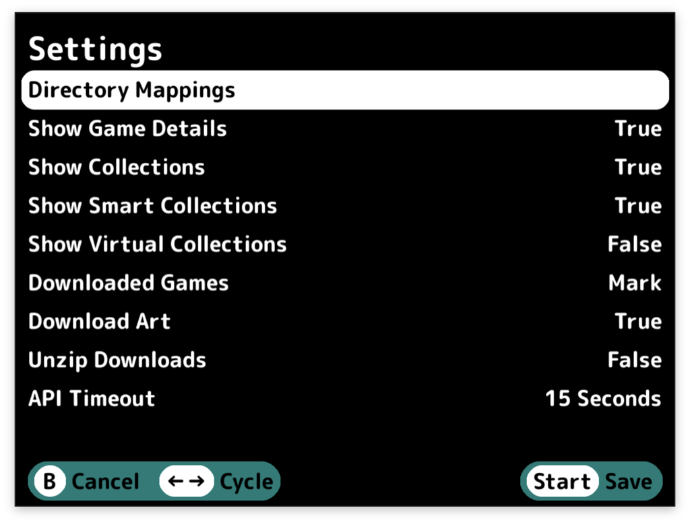

Here's what you can configure:

**Edit Mappings** – Change which device directories are mapped to which RomM platforms. This takes you back to
the platform mapping screen that appeared during setup.

**Show Game Details** - When enabled, selecting a game shows the details screen first. When disabled, selecting a game
immediately starts the download. If you know what you want and just want to grab it fast, turn this off.

**Show Collections** - When enabled, Grout displays regular collections in the main menu.

**Show Smart Collections** - When enabled, Grout displays smart collections in the main menu.

**Show Virtual Collections** - When enabled, Grout displays virtual collections in the main menu.

**Downloaded Games** - Controls how already-downloaded games appear in game lists:
- **Do Nothing** – No special treatment for downloaded games
- **Mark** – Downloaded games are marked with a checkmark indicator
- **Filter** – Downloaded games are hidden from the list entirely

**Download Art** – When enabled, Grout downloads box art for games after downloading the ROMs. The art goes into your
artwork directory so your frontend can display it.

**Unzip Downloads** - When enabled, Grout automatically extracts zipped ROMs after downloading. The zip file is deleted
after extraction. Useful if you prefer keeping ROMs uncompressed.

**API Timeout** – How long Grout waits for responses from your RomM server before giving up. If you have a slow
connection or are a completionist with a heavily loaded server, increase this. Options range from 15 to 300 seconds.

**Download Timeout** – How long Grout waits for a single ROM to download before giving up. Useful for large files or
slow connections. Options range from 15 to 120 minutes.

**Language** – Grout is localized! Choose between English, Spanish, and French. If you notice an issue with a translation or want to help by translating please let
us know!

**Log Level** – Set to Debug if you're troubleshooting issues and want detailed logs. Otherwise, Error is fine.

**Info** – View version information, build details, server connection info, and the GitHub repository QR code.

Use `Left/Right` to cycle through options. Press `Start` to save your changes, or `B` to cancel.

---

## Save Sync

> [!IMPORTANT]
> This feature requires RomM v4.5.0 as it relies on an endpoint released in this version.

Save Sync keeps your game saves synchronized between your RomM server and your handheld device.

To access save sync, press `Y` from the platform menu.

### How It Works

When you run Save Sync, Grout:

1. Scans your device for games and their save files
2. Matches them with corresponding ROMs in RomM
3. Compares local and remote save files
4. Syncs saves based on which version is newer

### Sync Logic

For each save file found on your device, Grout determines what action to take:

**When RomM has no save:**

- Your local save is uploaded to RomM (with timestamp appended to filename)

**When you have no local save:**

- RomM's save is downloaded to your device

**When both exist:**

- The newer save (based on last modified time) determines the action
- If the local save is newer, it is uploaded to RomM with the last modified timestamp appended to the filename
- If the RomM save is newer
    - The current local save is backed up to `.backup/` within the platform's save directory
    - The RomM save is downloaded to your device

**When there's no matching ROM in RomM:**

- The save file is reported as "unmatched" in the sync results

### Emulator Selection

Some platforms (like Game Boy Advance on muOS) support multiple emulators, each with its own save directory.

If Grout detects multiple possible save locations, it will prompt you to select which emulator you're using:

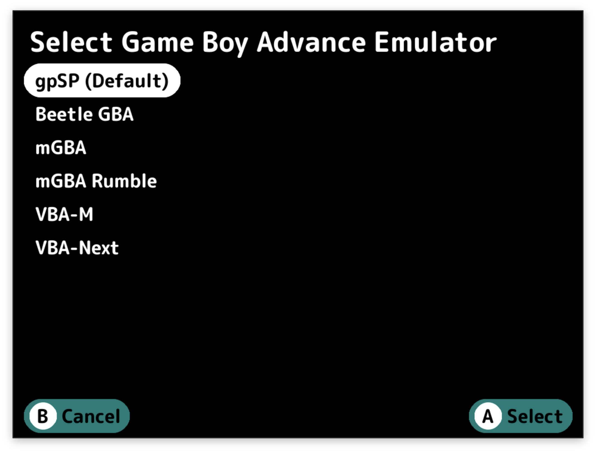

Choose your active emulator to ensure the correct saves are synced.

### Sync Results

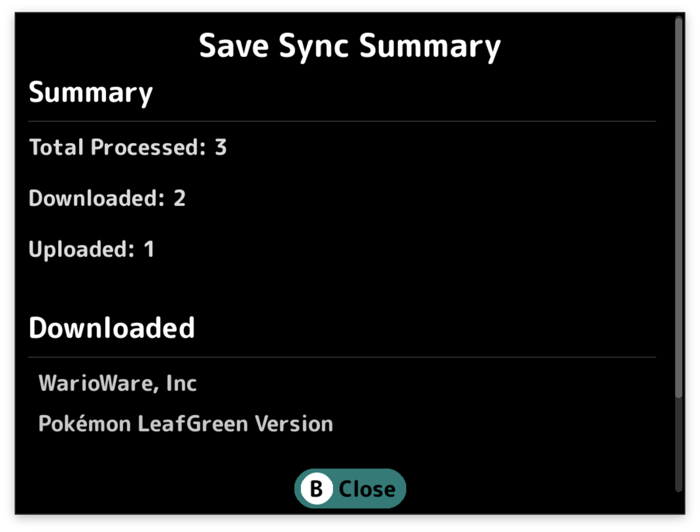

After syncing, you'll see a summary showing:

- Downloaded saves (from RomM to device)
- Uploaded saves (from device to RomM)
- Unmatched saves (local saves without corresponding ROMs in RomM)
- Any errors that occurred

### Important Notes

- **Save files only:** This works with save files, **NOT** save states
- **Save states conflict:** If you use save states with autoload enabled, disable autoload or delete the state after
  downloading a save, otherwise the emulator will load the state instead
- **User-specific:** Saves are tied to your RomM user account – keep this in mind if you share your RomM account
- **Backup protection:** When a save is downloaded from RomM, the current save is backed up with a timestamp appended to
  the filename to aid in recovery
